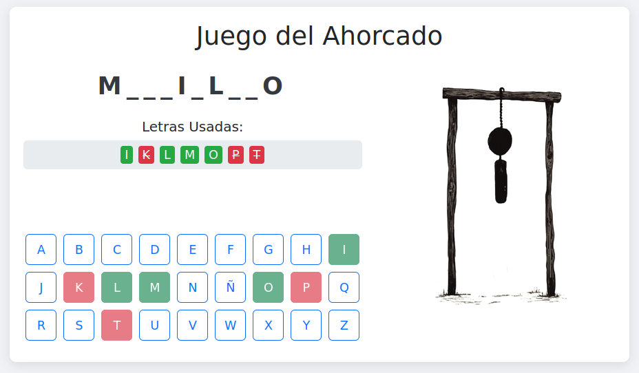

# 🎮 Juego del Ahorcado
[](https://opensource.org/licenses/MIT) [](https://soyunomas.github.io/juego-ahorcado/ahorcado.html)

Un clásico juego del Ahorcado desarrollado en HTML, CSS y JavaScript, utilizando Bootstrap 5 para una interfaz limpia y responsiva. ¡Perfecto para dos jugadores en un mismo dispositivo! 💀🔡

## 📝 Descripción Breve

Este proyecto es una implementación web del popular juego de adivinanzas "El Ahorcado". Un jugador define una palabra o frase secreta, y el otro jugador intenta adivinarla letra por letra antes de que se complete la figura del ahorcado. El juego está contenido en un único archivo HTML para simplicidad y fácil portabilidad.

## 🖼️ Captura de Pantalla / Demo

 

Puedes probar la demo en vivo aquí:

*   **[Demo - Jugar Ahora](https://soyunomas.github.io/juego-ahorcado/ahorcado.html)**

## ✨ Características Principales

*   **🧑‍🤝‍🧑 Modo Dos Jugadores Local:** Un jugador introduce la palabra/frase, el otro adivina.
*   **🔑 Ofuscación de Palabra:** La palabra secreta se ingresa en un campo tipo contraseña.
*   **🖼️ Progreso Visual:** La figura del ahorcado se actualiza con cada error, usando una secuencia de imágenes (`1.png` a `8.png`).
*   **⌨️ Teclado Virtual Interactivo:** Permite seleccionar letras fácilmente y deshabilita las ya usadas, marcando aciertos y errores.
*   **💬 Feedback Claro:** Mensajes para aciertos, errores, letras repetidas, victoria y derrota.
*   **🔡 Soporte para Frases y Acentos:** Permite adivinar frases con espacios (los espacios no se adivinan) y maneja correctamente las letras con acentos (ej., si la palabra es "CANCIÓN", adivinar "O" o "Ó" la revelará).
*   **🔄 Reinicio Fácil:** Opción de jugar una nueva partida inmediatamente después de ganar o perder.
*   **📱 Diseño Responsivo:** Interfaz adaptable a diferentes tamaños de pantalla (escritorio, tablet, móvil), con ajustes específicos para móviles en vista vertical (imagen más pequeña, título principal oculto).
*   **🧩 Código Autónomo:** Todo en un solo archivo HTML con CSS y JavaScript incrustados para máxima simplicidad.

## 🛠️ Tecnologías Utilizadas

*   **HTML5:** Estructura semántica del contenido del juego.
*   **CSS3:** Estilos personalizados para la interfaz del juego y adaptabilidad (media queries).
*   **Bootstrap 5.3.x:** Framework CSS/JS utilizado para layout responsivo (grid), componentes (botones, alertas) y utilidades.
*   **JavaScript (ES6+):** Lógica completa del juego, manipulación del DOM, gestión de eventos (clics en teclado, inicio/reinicio), y manejo de estados del juego.
*   **CDNs:** Bootstrap (CSS y JS) se carga desde CDNs.

## 🚀 Instalación / Visualización Local

Este proyecto es una aplicación web estática del lado del cliente. Para ejecutarla localmente:

1.  **Clona el repositorio (o descarga los archivos):**
    ```bash
    git clone https://github.com/soyunomas/juego-ahorcado.git 
    ```
    (Reemplaza con la URL final de tu repositorio si es diferente)
2.  **Navega al directorio del proyecto:**
    ```bash
    cd juego-ahorcado
    ```
3.  **Asegúrate de tener las imágenes:**
    *   Coloca las imágenes del ahorcado (nombradas `1.png`, `2.png`, ..., `8.png`) en el mismo directorio que el archivo `ahorcado.html`.
4.  **Abre el archivo HTML principal:**
    *   Abre el archivo `ahorcado.html` (o como lo hayas llamado) directamente en tu navegador web preferido (Chrome, Firefox, Edge, etc.).
5.  **🌐 Conexión a Internet (Recomendado):** Es necesaria para cargar Bootstrap (CSS y JS) desde sus respectivos CDNs. Si quieres usarlo offline, necesitarías descargar Bootstrap y enlazarlo localmente.

## 🕹️ Cómo Jugar

1.  **Configuración (Jugador 1):**
    *   Al cargar la página, el Jugador 1 ingresa la palabra o frase secreta en el campo provisto (se ocultará al escribir).
    *   Presiona "Iniciar Juego".
2.  **Adivinanza (Jugador 2):**
    *   La interfaz cambia. Se muestra la palabra oculta con guiones (y espacios si es una frase) y la imagen inicial del ahorcado.
    *   El Jugador 2 usa el teclado virtual en pantalla para proponer letras.
3.  **Progreso del Juego:**
    *   **Acierto:** Si la letra es correcta, se revela en todas sus posiciones. La imagen del ahorcado no cambia.
    *   **Error:** Si la letra es incorrecta, se notifica, la letra se marca como usada e incorrecta, y la imagen del ahorcado avanza a la siguiente etapa.
    *   Las letras ya intentadas se muestran y se desactivan en el teclado.
4.  **Fin del Juego:**
    *   **Victoria:** Si el Jugador 2 adivina todas las letras antes de completar el ahorcado, se muestra un mensaje de victoria.
    *   **Derrota:** Si se cometen 7 errores (mostrando la imagen `8.png`), se muestra un mensaje de derrota y se revela la palabra/frase secreta.
5.  **Reiniciar:** Después de una victoria o derrota, aparece un botón "Jugar de Nuevo" para comenzar otra partida.

## 📄 Licencia

Este proyecto está bajo la Licencia MIT.
[](https://opensource.org/licenses/MIT)

## 🧑‍💻 Contacto

Creado por **soyunomas** ([@soyunomas en GitHub](https://github.com/soyunomas))

---
